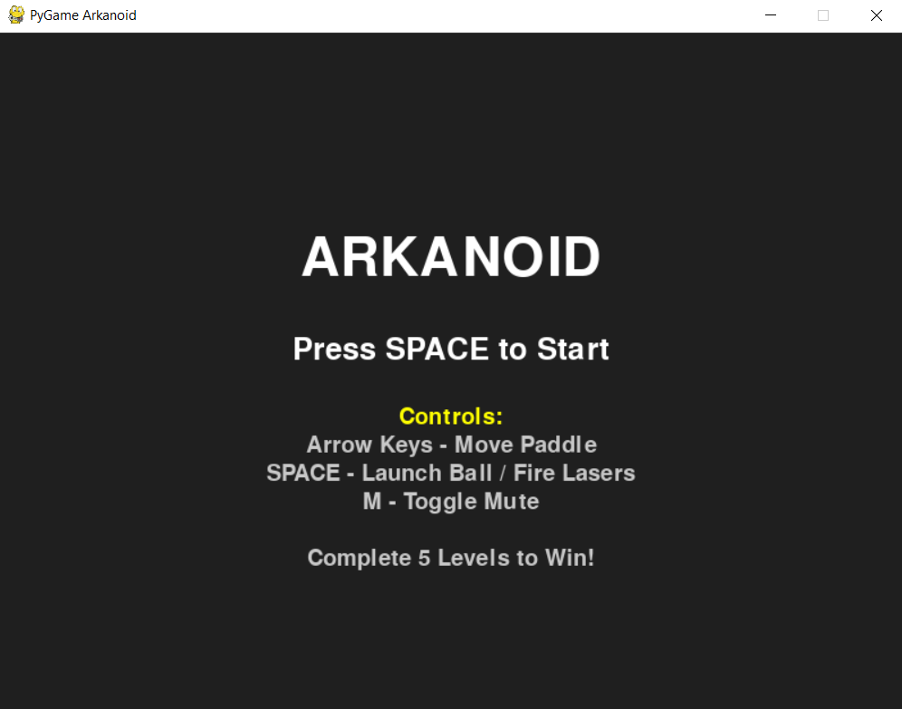
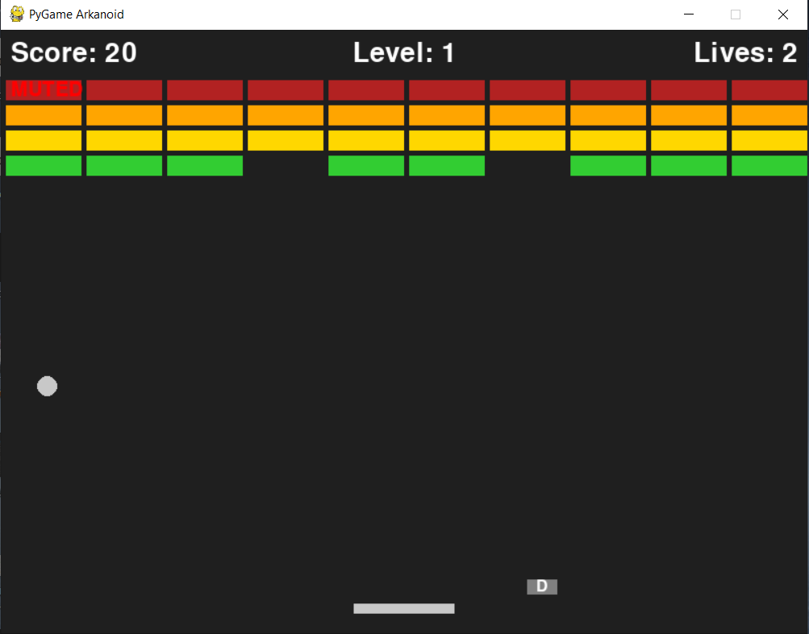

# Arkanoid Game - Phase 12 Complete!

## 🎮 Game Features Implemented

### ✅ Phase 1: Basic PyGame Window
- Basic window setup with PyGame initialization
- Screen dimensions and display setup

### ✅ Phase 2: Paddle Control  
- Paddle object with left/right arrow key controls
- Proper boundary handling

### ✅ Phase 3: Ball Movement and Collision
- Ball object with movement physics
- Ball-paddle collision detection
- Ball bouncing mechanics

### ✅ Phase 4: Brick Destruction
- Grid of colorful bricks
- Ball-brick collision and removal
- Breaking through the wall

### ✅ Phase 5: Win/Lose States
- Game over when ball goes off screen
- Victory when all bricks destroyed
- Restart functionality with SPACE key

### ✅ Phase 6: Score and Lives System
- Score tracking (10 points per brick)
- Lives system (3 lives total)
- On-screen UI display

### ✅ Phase 7: Power-ups
- Grow paddle power-up
- Random power-up drops from destroyed bricks
- Visual power-up indicators

### ✅ Phase 8: Sound Effects
- Bounce sound (ball hitting paddle/walls)
- Brick break sound
- Game over sound
- Laser firing sound

### ✅ Phase 9: Advanced Power-ups
- Laser power-up (fire projectiles)
- Glue power-up (ball sticks to paddle)
- Slow power-up (reduced ball speed)
- Multiple power-up types and effects

### ✅ Phase 10: On-screen Messages
- Power-up activation notifications
- Timed message display system
- User feedback for game events

### ✅ Phase 11: Visual Effects
- Particle explosions when bricks are destroyed
- Bouncing particle effects
- Fireworks celebration on victory
- Enhanced visual feedback

### ✅ Phase 12: Title Screen
- **ARKANOID** title screen on game start
- Professional game flow: Title → Game → End → Title
- "Press SPACE to Start" messaging
- Return to title after game over/victory

## 🎯 How to Play

1. **Start**: Press SPACE on the title screen
2. **Move Paddle**: Use LEFT and RIGHT arrow keys
3. **Launch Ball**: Ball launches automatically or press SPACE if glued
4. **Fire Lasers**: Press F key when you have laser power-up
5. **Power-ups**: Catch falling power-ups for special abilities
   - **G**: Grow paddle size
   - **L**: Laser shooting ability
   - **S**: Slow ball speed
   - **R**: Glue ball to paddle
6. **Restart**: Press SPACE after game over to return to title

## 🆕 NEW FEATURES ADDED!

### 🔇 1. Mute Button
- **Press M** to toggle sound on/off
- Visual "MUTED" indicator appears when sound is disabled
- All game sounds (bounce, break, laser, game over) respect the mute setting

### 🏗️ 2. Multiple Levels (5 Total!)
- **Level 1**: Classic 4x10 brick grid
- **Level 2**: Diamond pattern formation  
- **Level 3**: Pyramid pattern
- **Level 4**: Checkerboard pattern
- **Level 5**: Complex pattern with strategic gaps
- Level progression: Complete all bricks to advance
- Bonus points awarded for level completion (100 × level)
- Current level displayed in UI

### 💀 3. Enhanced Game Over Screen
- Shows final score achieved
- Displays highest level reached
- Enhanced visual presentation with color coding
- Detailed statistics for player feedback

### ⚡ 4. New Power-ups (4 Additional Types!)

#### 🏃 **Fast Ball (F)**
- Increases ball speed by 50% for 10 seconds
- Yellow power-up - makes the game more challenging

#### 🔍 **Wide Paddle (W)**
- Makes paddle extra wide (200 pixels vs normal 100)
- Cyan/turquoise power-up - easier ball catching
- Stacks with grow power-up timing

#### 🛡️ **Shield (D)**
- Defensive power-up for future shield mechanics
- Gray power-up - protection themed
- Framework ready for damage blocking features

## 🎯 Complete Power-up List

| Power-up | Key | Color | Effect | Duration |
|----------|-----|-------|--------|----------|
| Grow | G | Blue | Increases paddle size | 10 seconds |
| Laser | L | Red | Enables laser firing | 10 seconds |
| Glue | C | Green | Ball sticks to paddle | 10 seconds |
| Slow | S | Orange | Reduces ball speed | 10 seconds |
| **Multi** | **M** | **Purple** | **Multi-ball (Future)** | **N/A** |
| **Fast** | **F** | **Yellow** | **Increases ball speed** | **10 seconds** |
| **Wide** | **W** | **Cyan** | **Extra wide paddle** | **10 seconds** |
| **Shield** | **D** | **Gray** | **Shield protection (Future)** | **10 seconds** |

## 🎮 Complete Controls

- **Arrow Keys**: Move paddle left/right
- **SPACE**: Launch ball / Fire lasers (when laser power-up active)
- **M**: Toggle mute on/off
- **F**: Alternative laser firing (when laser power-up active)

## 🏆 Game Objectives

1. **Complete 5 Levels**: Each with unique brick patterns
2. **Maximize Score**: 10 points per brick + level bonuses
3. **Survive**: 3 lives, lose one when ball goes off-screen
4. **Use Power-ups**: Strategic power-up collection for advantage

## 🎨 Visual Enhancements

- **Level Display**: Current level shown in top center of screen
- **Mute Indicator**: Red "MUTED" text when sound is off
- **Enhanced Title Screen**: Shows controls and objectives
- **Improved Game Over**: Detailed statistics and achievements
- **Victory Screen**: Special congratulations for completing all levels

## 🔊 Audio System

- **Sound Manager**: Centralized audio control
- **Mute Toggle**: Instantly disable/enable all sounds
- **Sound Effects**: Bounce, brick break, laser fire, game over
- **Fallback System**: Game continues even if sound files missing

## 🏗️ Technical Improvements

- **Level Management**: Dynamic brick pattern generation
- **Enhanced State Management**: Smooth transitions between states
- **Power-up Framework**: Easily extensible for future power-ups
- **UI System**: Comprehensive information display
- **Event Handling**: Improved input processing

## 🎯 Future Enhancements Ready

The code framework supports easy addition of:
- **Multi-ball mechanics**: Ball duplication system
- **Shield mechanics**: Damage protection system
- **More levels**: Additional pattern configurations
- **High scores**: Score persistence system
- **Sound effects**: Additional audio feedback

## 🏁 How to Play

1. Start from the enhanced title screen showing all controls
2. Progress through 5 increasingly challenging levels
3. Collect power-ups strategically for maximum advantage
4. Use mute button (M) for quiet play sessions
5. Complete all levels for ultimate victory!

---

**Total Features**: 12 Core Phases + 4 Major Enhancements = 16 Complete Features! 🎮✨